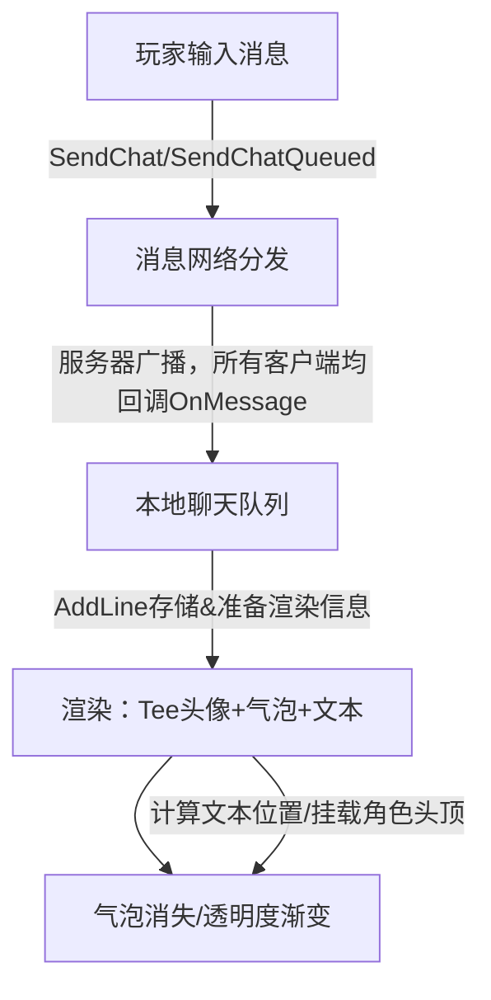

[](https://tclient.app) 

[](https://github.com/TaterClient/TClient/actions/workflows/build.yaml)
<!-- [](https://codecov.io/gh/TaterClient/TClient/branch/master) -->
<!-- [](https://hosted.weblate.org/engage/ddnet/) -->

### Taters custom ddnet client with some modifications

Not guaranteed to be bug free, but I will try to fix them.

If ddnet devs are reading this and want to steal my changes please feel free.

Thanks to tela for the logo design, and solly for svg <3

### Links

[Discord](https://discord.gg/BgPSapKRkZ)
[Website](https://tclient.app)

### Installation

* Download the latest [release](https://github.com/sjrc6/TaterClient-ddnet/releases)
* Download a [nightly (dev/unstable) build](https://github.com/sjrc6/TaterClient-ddnet/actions/workflows/fast-build.yml?query=branch%3Amaster)
* [Clone](https://docs.github.com/en/repositories/creating-and-managing-repositories/cloning-a-repository) this repo and build using the [guide from DDNet](https://github.com/ddnet/ddnet?tab=readme-ov-file#cloning)

### Translation

FTAPI (a simple wrapper for Google translate) will work out of the box, however it will quickly become overloaded

This is a guide for setting up [libretranslate](https://docs.libretranslate.com/guides/installation/)

First you need an old version of python (3.8, 3.9 or 3.10), along with `pip`

If you do not have this you can use [conda](https://www.anaconda.com/docs/getting-started/miniconda/install#quickstart-install-instructions) to install it

```sh
conda create -n libretranslate python=3.9
conda activate libretranslate
```

Then you can install and run libretranslate, do note that this requires large libraries like `torch` so it's a couple of gigs

```sh
pip install libretranslate
libretranslate
```

You can then set `tc_translate_backend libretranslate`, the port is automatically 5000

### Scripting

TClient supports the [ChaiScript](https://chaiscript.com/) language for simple tasks

Add scripts to your config dir then run them with `chai [scriptname] [args]`

> [!CAUTION]
> There are no runtime restrictions, you can easily `while (true) {}` yourself or run out of memory, be careful!

```js
var a // Declare a variable
a = 1 // Set it
var b = 2 // Do both at once
var c = "strings"
var d = ["lists", 2] // not strongly typed
// var e, f = d // no list deconstruction
print(d[0] + to_string(d[1])) // explicit to_string required for string concat
var bass = "ba" + "s" + "s"
var ass = bass.substr(1, -1) // both indices required, use -1 for end
if (a == b) { // brackets required
	print("this will never happen") // output
} else if (c == "strings") { // string comparison
	exec("echo hello world") // run console stuff
}
var current_game_mode = state("game_mode") // Get the current game mode, all states you can get are listed below
def myfunc(a, b, c) { // yeah it uses def for function definition idk
	print(a, b, c)
	if (a == b) { return "early" }
	c // last statement returns like in rust
}
print(myfunc(1, 2, 3)) // prints "early"
for (var i = 0; i < 10; i++) { // for loops (c style)
	print(i) // auto converts to string, will throw if it cant
}
return "top level return"
```

Here is a list of states which are available:

| Return type | Call | Description |
| --- | -- | --- |
| `string` | `state("game_mode")` | Returns the current game mode name (e.g., “DM”, “TDM”, “CTF”). |
| `bool` | `state("game_mode_pvp")` | Whether the current mode is PvP. |
| `bool` | `state("game_mode_race")` | Whether the current mode is a race mode. |
| `bool` | `state("eye_wheel_allowed")` | Whether the “eye wheel” feature is allowed on this server. |
| `bool` | `state("zoom_allowed")` | Whether camera zoom is allowed. |
| `bool` | `state("dummy_allowed")` | Whether using a dummy client is allowed. |
| `bool` | `state("dummy_connected")` | Whether the dummy client is currently connected. |
| `bool` | `state("rcon_authed")` | Whether the client is authenticated with RCON (admin access). |
| `int` | `state("team")` | The player’s current team number. |
| `int` | `state("ddnet_team")` | The player’s DDNet team number. |
| `string` | `state("map")` | The name of the current or connecting map. |
| `string` | `state("server_ip")` | The IP address of the connected or connecting server. |
| `int` | `state("players_connected")` | Number of currently connected players. |
| `int` | `state("players_cap")` | Maximum number of players the server supports. |
| `string` | `state("server_name")` | The server’s name. |
| `string` | `state("community")` | The server’s community identifier. |
| `string` | `state("location")` | The player’s approximate map location (“NW”, “C”, “SE”, etc.). |
| `string` | `state("state")` | The client’s connection state (e.g., “online”, “offline”, “loading”, “demo”). |
| `int` | `state("id", string Name)` | Finds and returns a client ID by player name (exact or case-insensitive match). |
| `string` | `state("name", int Id)` | Returns the name of a player given their client ID. |
| `string` | `state("clan", int Id)` | Returns the clan name of a player given their client ID. |

```js
var what = include("thatscript.chai") // you can include other scripts, they use absolute paths from config dir
print(what) // prints "top level return"
if (!file_exists("file")) { // check if a file exists, also absolute from config dir
	throw("why doesn't this file exist")
}
```

There is also `math` and `re` modules

```js
import("math")
math.pi
math.e
math.pow(1, 2)
math.sqrt(3)
math.sin(1)
math.cos(1)
math.tan(1)
math.asin(1)
math.acos(1)
math.atan(1)
math.atan2(1, 1)
math.log(1)
math.log10(1)
math.log2(1)
math.ceil(1)
math.floor(1)
math.round(1)
math.abs(1)
```

```js
import("re")

if(re.test(re.compile(".+?ello.+?"), "hello")) { // re.test(r, string)
	print("hi")
}
re.match(re.compile("\\d"), "h3ll0", false, fun[](str, match, group) { // re.match(r, string, global, callback)
	print("not global: " + to_string(match) + " " + str)
})
re.match(re.compile("\\d"), "h3ll0", true, fun[](str, match, group) {
	print("global: " + to_string(match) + " " + str)
})
re.match(re.compile("(h3)l(l0)"), "h3ll0", false, fun[](str, match, group) {
	print("groups: " + to_string(match) + " " + to_string(group) + " " + str)
})
print(re.replace(re.compile("\\d"), "h3ll0", true, fun[](str, match, group) { // re.replace(r, string, global, callback)
	if (str == "3") {
		return "e"
	} else if (str == "0") {
		return "o"
	}
	return str
}))
```

### Settings Page

> [!NOTE]
> This is out of date


### Features

> [!NOTE]
> This is out of date

```
tc_run_on_join_console
tc_run_on_join_delay
tc_nameplate_ping_circle
tc_hammer_rotates_with_cursor
tc_freeze_update_fix
tc_show_center
tc_skin_name
tc_color_freeze
tc_freeze_stars
tc_white_feet
tc_white_feet_skin
tc_mini_debug
tc_last_notify
tc_last_notify_text
tc_last_notify_color
tc_cursor_in_spec
tc_render_nameplate_spec
tc_fast_input
tc_fast_input_others
tc_improve_mouse_precision
tc_frozen_tees_hud
tc_frozen_tees_text
tc_frozen_tees_hud_skins
tc_frozen_tees_size
tc_frozen_tees_max_rows
tc_frozen_tees_only_inteam
tc_remove_anti
tc_remove_anti_ticks
tc_remove_anti_delay_ticks
tc_unpred_others_in_freeze
tc_pred_margin_in_freeze
tc_pred_margin_in_freeze_amount
tc_show_others_ghosts
tc_swap_ghosts
tc_hide_frozen_ghosts
tc_pred_ghosts_alpha
tc_unpred_ghosts_alpha
tc_render_ghost_as_circle
tc_outline
tc_outline_in_entities
tc_outline_freeze
tc_outline_unfreeze
tc_outline_tele
tc_outline_solid
tc_outline_width
tc_outline_alpha
tc_outline_alpha_solid
tc_outline_color_solid
tc_outline_color_freeze
tc_outline_color_tele
tc_outline_color_unfreeze
tc_player_indicator
tc_player_indicator_freeze
tc_indicator_alive
tc_indicator_freeze
tc_indicator_dead
tc_indicator_offset
tc_indicator_offset_max
tc_indicator_variable_distance
tc_indicator_variable_max_distance
tc_indicator_radius
tc_indicator_opacity
tc_indicator_inteam
tc_indicator_tees
tc_profile_skin
tc_profile_name
tc_profile_clan
tc_profile_flag
tc_profile_colors
tc_profile_emote
tc_auto_verify
tc_rainbow
tc_rainbow_others
tc_rainbow_mode
tc_reset_bindwheel_mouse
add_profile
add_bindwheel
remove_bindwheel
delete_all_bindwheel_binds
+bindwheel_execute_hover
+bindwheel
tc_regex_chat_ignore
tc_color_freeze_darken
tc_color_freeze_feet
tc_spec_menu_ID
tc_limit_mouse_to_screen
```

## 聊天气泡实现流程(Mermaid 图)



**说明要点：**
- 玩家输入通过 `SendChat/Queued`，本地和服务端互通后，每台客户端都用 `OnMessage→AddLine` 存储消息。
- 每条消息都保留了可选 Tee 头像渲染信息（如角色ID、外观、坐标等）。
- 渲染时不只画文字，若有角色，则在文本气泡旁边/头顶同时绘制对应 Tee。
- `OnPrepareLines` 负责气泡排布和消失动画控制。
